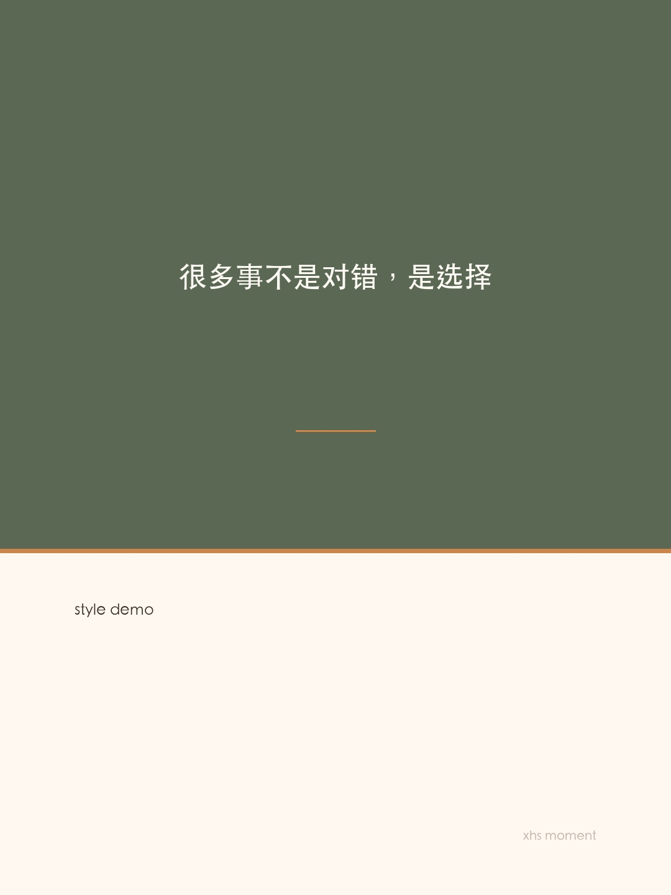
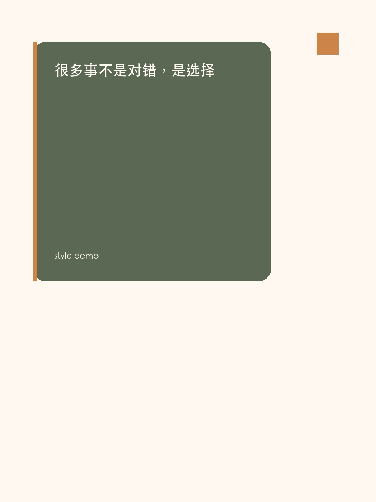
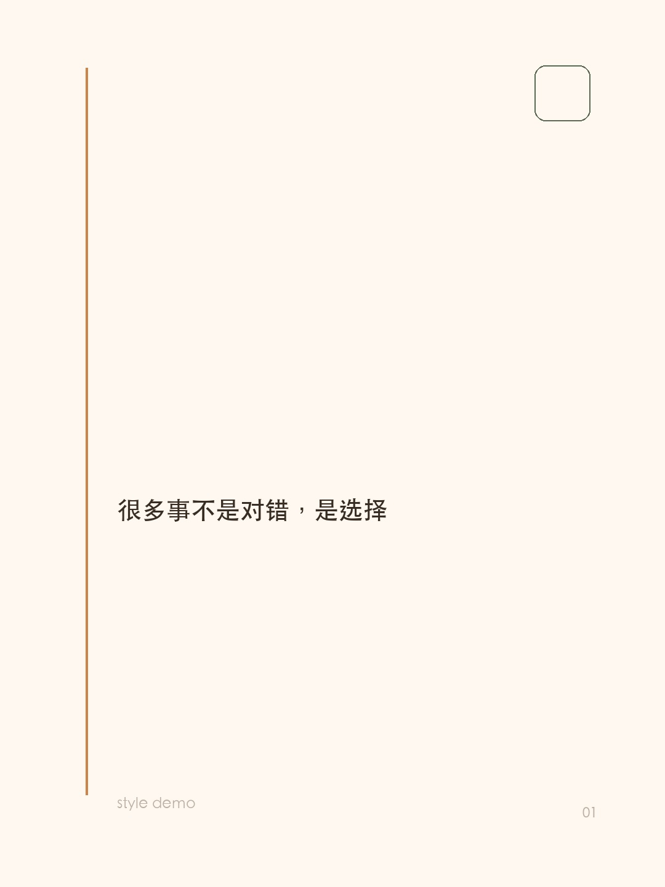
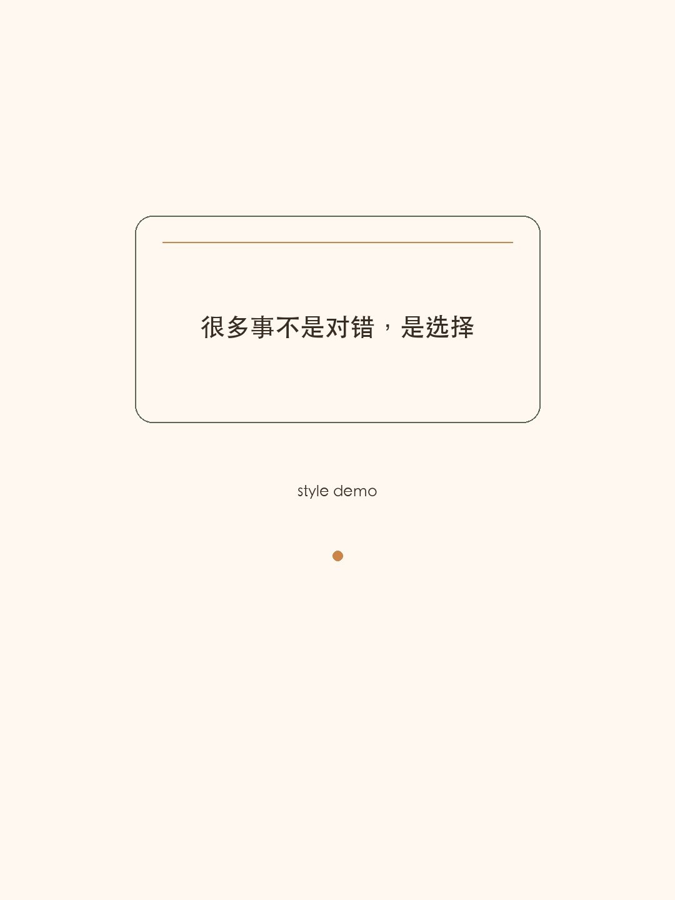
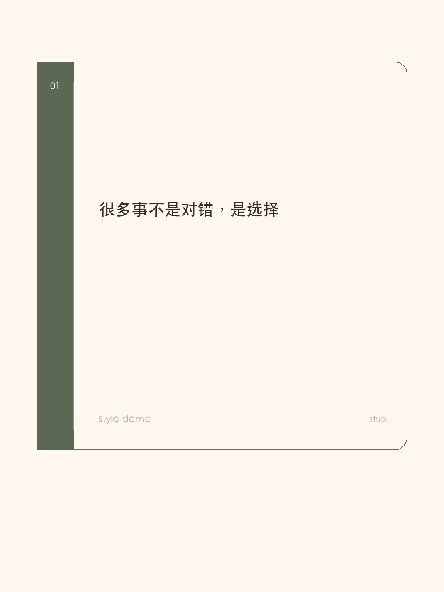
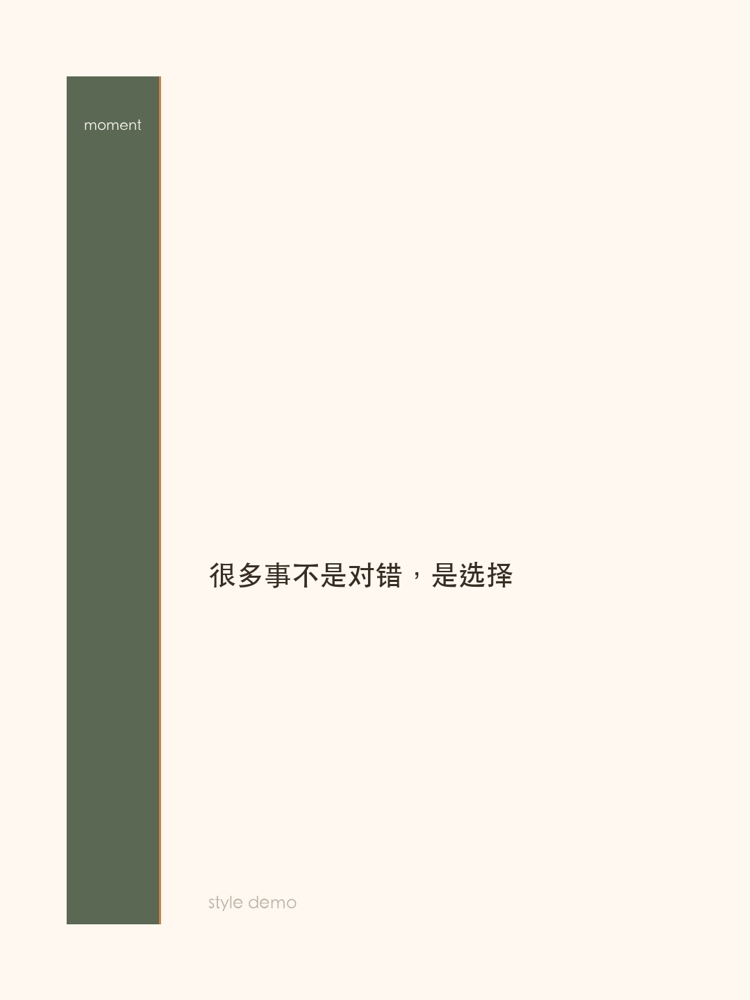
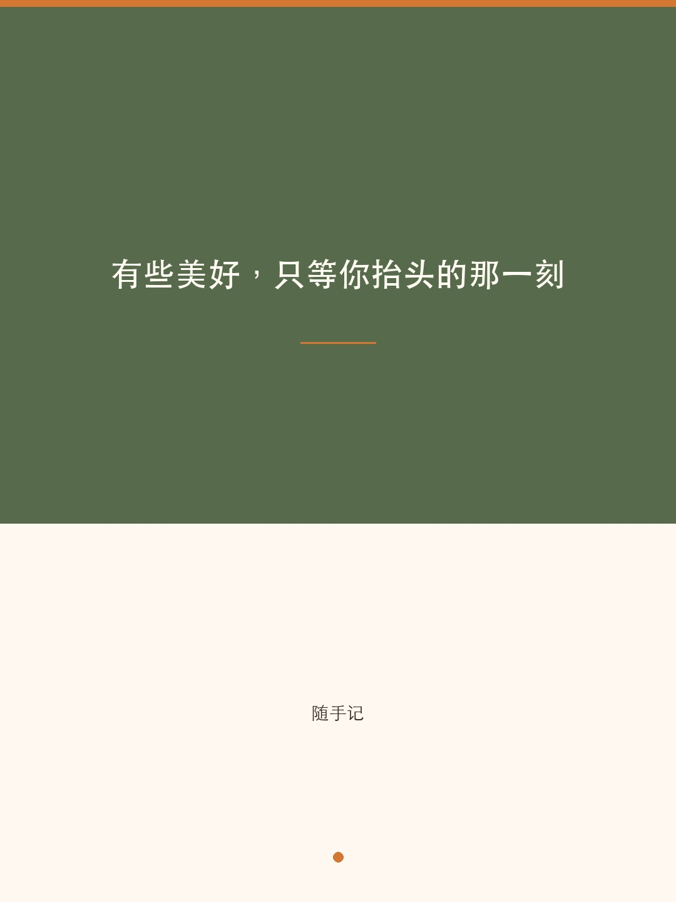
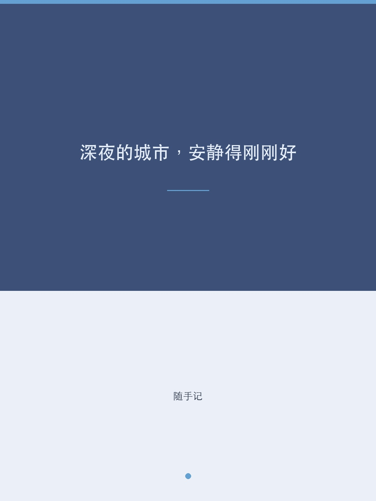
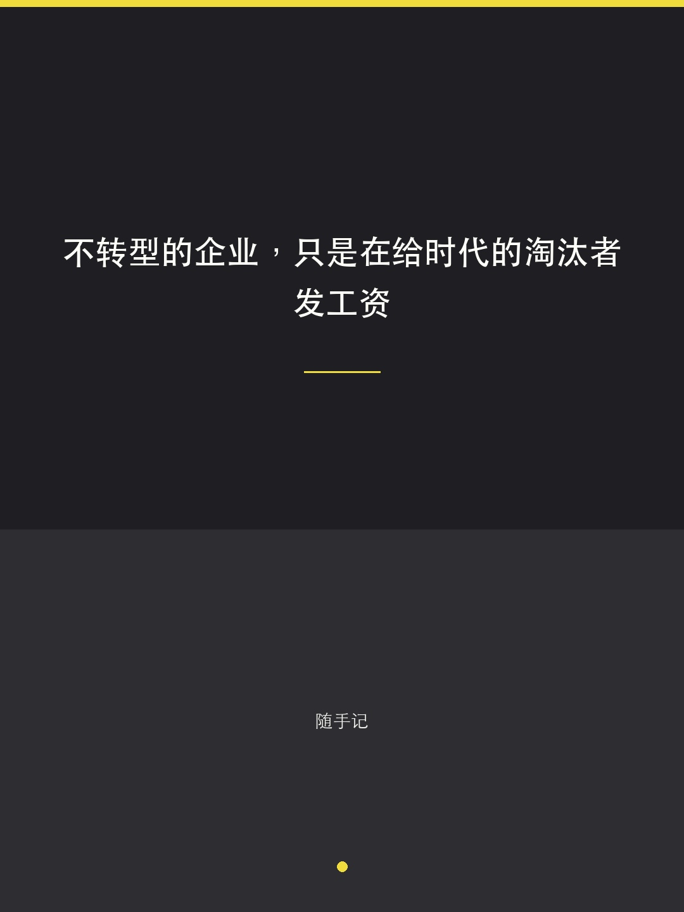

# xhs-moment — 小红书随手记

> 一句话秒生小红书帖子：AI 提炼文案 + 自动生成简约风配图 + 一键发布。

把生活中一闪而过的念头、感悟、吐槽，30 秒变成一条图文并茂的小红书帖子。

## Quick Start

```bash
# 1. 安装依赖
pip install Pillow

# 2. 生成配图
python3 scripts/generate.py \
  --text "生活不是等待暴风雨过去，而是学会在雨中起舞" \
  --palette auto \
  --style auto \
  --hashtags "生活感悟,治愈系,日常" \
  --output-dir ./output

# 3. 发布到小红书（需要 opencli）
npx opencli xiaohongshu publish \
  --title "学会在雨中起舞" \
  --images ./output/moment-1.jpg,./output/moment-2.jpg,./output/moment-3.jpg \
  --topics "生活感悟,治愈系,日常" \
  "你的正文内容..."
```

## 作为 AI Coding Tool 的 Skill 使用

将本目录复制到对应工具的 skills 目录：

```bash
# Claude Code
cp -r xhs-moment ~/.claude/skills/

# 然后在对话中说：
# "帮我发个小红书：今天的夕阳好美"
# "发个治愈系帖子"
# "/xhs-moment 不联系的朋友只是通讯录里的名字"
```

AI 会自动：分析情绪 → 按语义倾向挑版式 → 按版式与情绪联动挑配色 → 生成金句 → 出 3 张留白风配图 → 写文案 → 发布。

## 6 套配色

| 名称 | 风格 | 适用场景 |
|------|------|---------|
| `warm` | 橄榄绿 + 奶油色 | 温暖、治愈、感恩、晚安 |
| `cool` | 深蓝 + 冰蓝 | 平静、思考、深夜、孤独 |
| `fresh` | 森林绿 + 薄荷 | 元气、春天、活力、早安 |
| `elegant` | 酒红 + 亚麻 | 文艺、复古、咖啡、读书 |
| `dreamy` | 薰衣紫 + 淡紫 | 浪漫、梦幻、花、少女 |
| `bold` | 暗黑 + 荧光黄 | 态度、自信、犀利、酷 |

## 生成图片示例

每次生成 3 张 1080x1440 的图片，并默认带权随机选择一种版式：

```
golden-split      — 0.618 黄金分割，上大下小
floating-card     — 浮动文本卡，大留白
quiet-corner      — 角落落字，克制安静
centered-balance  — 居中平衡，围绕黄金线
ticket-stub       — 克制票券感，更像小红书图文封面
margin-label      — 侧边标签条，偏编辑感
```

### 不同版式模式示例

下面这组示例使用同一句文案生成，方便直接对比版式差异：
`很多事不是对错，是选择`

#### 1) golden-split

0.618 黄金分割，上大下小，适合做更稳重的标题封面。



#### 2) floating-card

浮动文本卡，画面更轻，留白感更强。



#### 3) quiet-corner

文字落在边角，安静克制，适合偏思考感的内容。



#### 4) centered-balance

居中平衡，更中性，适合稳定、规整的视觉表达。



#### 5) ticket-stub

票券式结构，更像小红书原生封面，也更适合当默认主力版式。



#### 6) margin-label

侧边标签条，编辑感更强，适合思考、表达、观点类内容。



> 每种模式实际都会输出 3 张图（封面图 / 金句卡 / 话题卡），上面展示的是各模式的封面图 `moment-1.jpg`。

`auto` 的权重倾向：
- 基础版式高频：`ticket-stub`、`margin-label`
- 基础版式中频：`quiet-corner`
- 基础版式低频：`golden-split`、`floating-card`、`centered-balance`
- 语义会进一步干预版式，例如：
  - 思考 / 认知类，更偏 `margin-label` / `quiet-corner`
  - 治愈 / 日常类，更偏 `ticket-stub` / `floating-card`
  - 态度 / 表达类，更偏 `margin-label`
- 配色也会按版式与情绪联动，比如：
  - `ticket-stub` 更偏 `warm` / `elegant`
  - `margin-label` 更偏 `cool` / `bold`
  - 浪漫类更容易落到 `dreamy`

输出文件：

```
moment-1.jpg — 封面图
moment-2.jpg — 金句卡
moment-3.jpg — 话题卡
meta.json    — 本次使用的 palette/style/mood 元信息
```

<p align="center">
  
  
  
</p>

## 脚本参数

```
python3 scripts/generate.py [OPTIONS]

必选:
  --text TEXT           金句/核心文字（渲染在图片上）

可选:
  --subtitle TEXT       副标题（日期、署名等，默认"随手记"）
  --palette PALETTE     配色方案: auto|warm|cool|fresh|elegant|dreamy|bold（默认 auto，且 auto 会按版式与情绪联动）
  --style STYLE         版式: auto|golden-split|floating-card|quiet-corner|centered-balance|ticket-stub|margin-label（默认 auto，且 auto 为带权随机）
  --mood MOOD           情绪语义: auto|thinking|healing|attitude|romantic|fresh|neutral（默认 auto）
  --seed TEXT           可选，给 auto 一个固定随机种子，便于复现
  --hashtags TEXT       话题标签，逗号分隔（默认"随手记"）
  --output-dir DIR      输出目录（默认 /tmp/xhs-moment）
```

## 跨平台支持

脚本自动检测系统字体：

| 系统 | 字体 |
|------|------|
| macOS | STHeiti / PingFang |
| Windows | Microsoft YaHei / SimHei |
| Linux | Noto Sans CJK / Droid Sans Fallback |

## 发布依赖（可选）

自动发布到小红书需要 [OpenCLI](https://github.com/jackwener/OpenCLI)：

```bash
npm install -g @jackwener/opencli
```

并在 Chrome 中安装 OpenCLI Browser Bridge 扩展，登录 `creator.xiaohongshu.com`。

不安装 OpenCLI 也可以单独使用图片生成功能，手动发布。

## 项目结构

```
xhs-moment/
├── SKILL.md              # AI Skill 定义（Claude Code / OpenClaw / OpenCode）
├── README.md             # 本文件
├── LICENSE               # MIT
├── requirements.txt      # Python 依赖
├── scripts/
│   └── generate.py       # 图片生成脚本（Pillow）
└── examples/
    ├── warm.jpg          # 历史配色示例
    ├── cool.jpg          # 历史配色示例
    ├── bold.jpg          # 历史配色示例
    ├── golden-split/     # 版式示例（3 张）
    ├── floating-card/    # 版式示例（3 张）
    ├── quiet-corner/     # 版式示例（3 张）
    ├── centered-balance/ # 版式示例（3 张）
    ├── ticket-stub/      # 版式示例（3 张）
    └── margin-label/     # 版式示例（3 张）
```

## License

MIT
