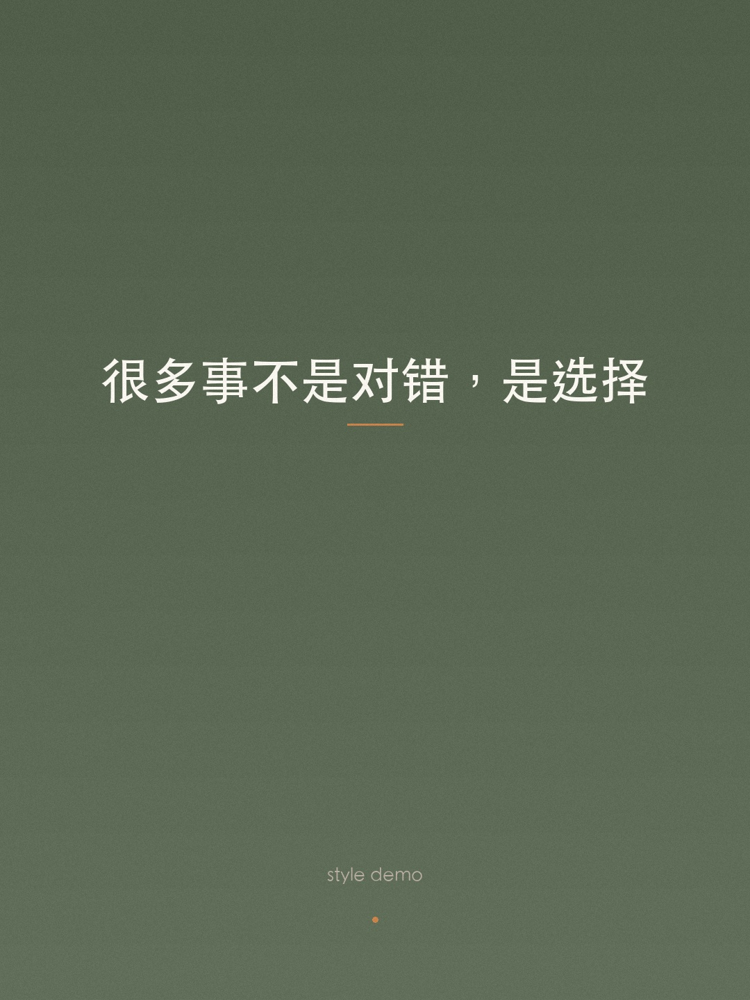
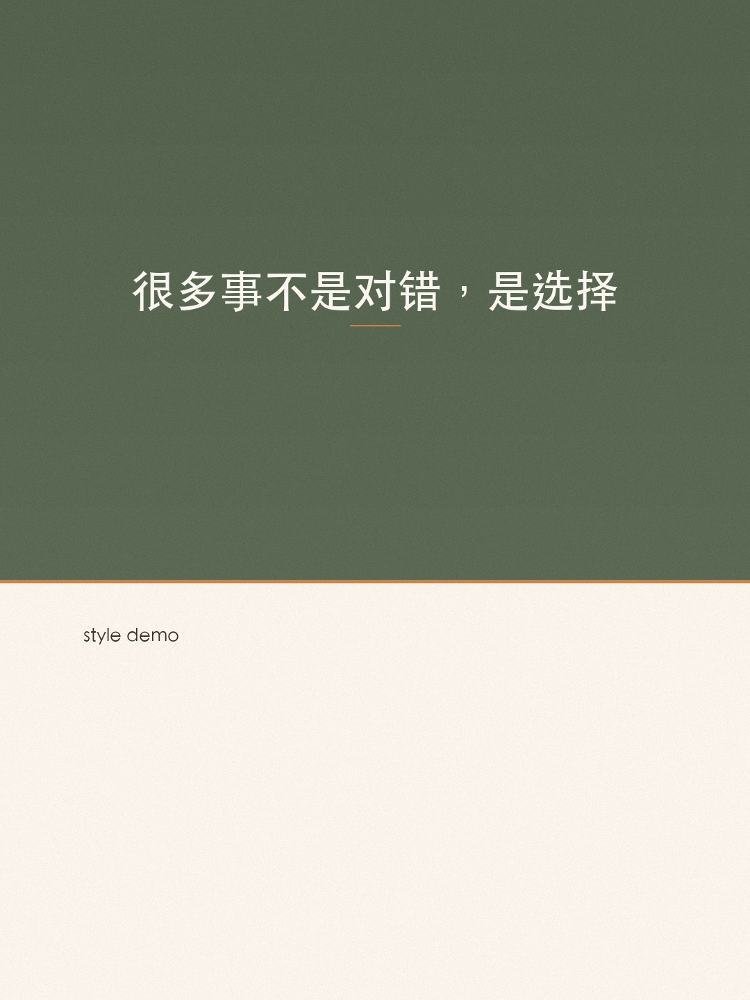
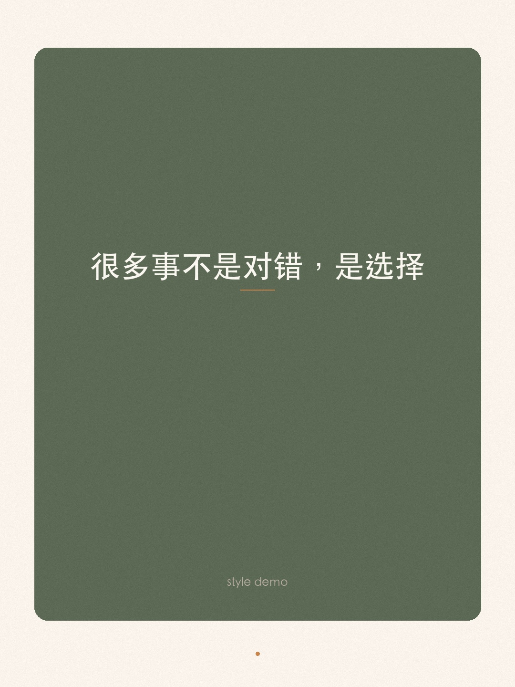
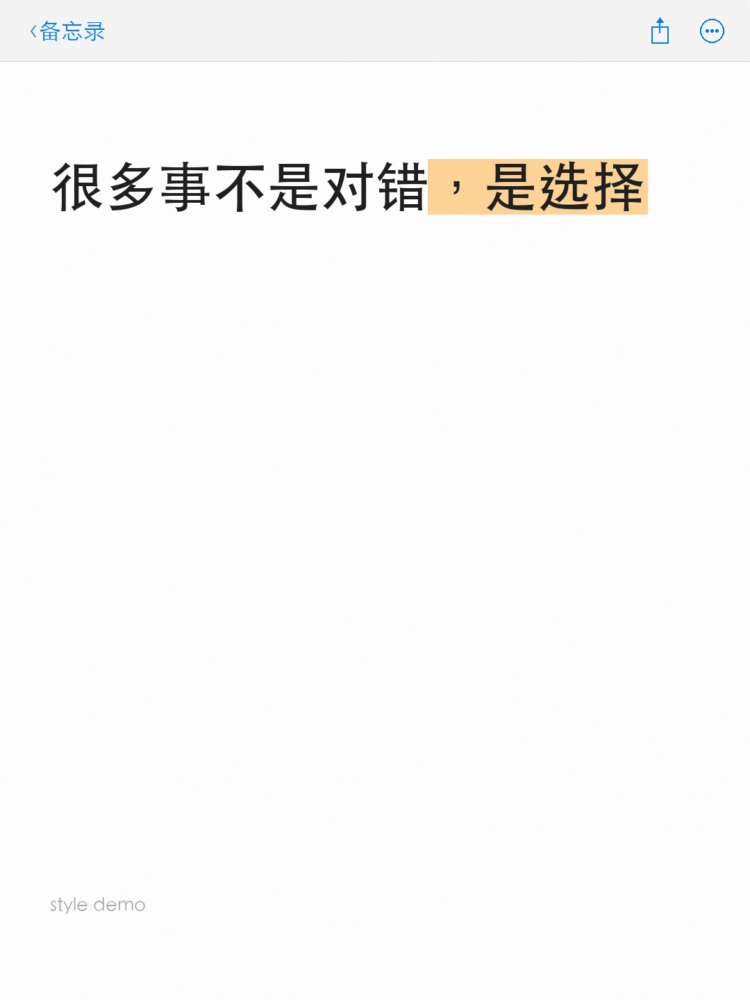

# xhs-moment — 小红书随手记

> 一句话秒生小红书帖子：AI 提炼文案 + 自动生成简约风配图 + 一键发布。

把生活中一闪而过的念头、感悟、吐槽，30 秒变成一条图文并茂的小红书帖子。

## Quick Start

```bash
# 1. 安装依赖
pip install Pillow

# 2. 生成配图
python3 scripts/generate.py \
  --text "生活不是等待暴风雨过去，而是学会在雨中起舞" \
  --palette auto \
  --style auto \
  --hashtags "生活感悟,治愈系,日常" \
  --output-dir ./output

# 3. 发布到小红书（需要 opencli）
npx opencli xiaohongshu publish \
  --title "学会在雨中起舞" \
  --images ./output/moment-1.jpg,./output/moment-2.jpg,./output/moment-3.jpg \
  --topics "生活感悟,治愈系,日常" \
  "你的正文内容..."
```

## 作为 AI Coding Tool 的 Skill 使用

将本目录复制到对应工具的 skills 目录：

```bash
# Claude Code
cp -r xhs-moment ~/.claude/skills/

# 然后在对话中说：
# "帮我发个小红书：今天的夕阳好美"
# "发个治愈系帖子"
# "/xhs-moment 不联系的朋友只是通讯录里的名字"
```

AI 会自动：分析情绪 → 按语义倾向挑版式 → 按版式与情绪联动挑配色 → 生成金句 → 出 3 张留白风配图 → 写文案 → 发布。

## 6 套配色

| 名称 | 风格 | 适用场景 |
|------|------|---------|
| `warm` | 橄榄绿 + 奶油色 | 温暖、治愈、感恩、晚安 |
| `cool` | 深蓝 + 冰蓝 | 平静、思考、深夜、孤独 |
| `fresh` | 森林绿 + 薄荷 | 元气、春天、活力、早安 |
| `elegant` | 酒红 + 亚麻 | 文艺、复古、咖啡、读书 |
| `dreamy` | 薰衣紫 + 淡紫 | 浪漫、梦幻、花、少女 |
| `bold` | 暗黑 + 荧光黄 | 态度、自信、犀利、酷 |

## 5 种版式

每次生成 3 张 1080x1440 的图片（封面 / 金句 / 话题），带 film-grain 纹理质感。

下面这组示例使用同一句文案对比版式差异：`很多事不是对错，是选择`

### poster — 全画幅海报

全屏色块 + 渐变 + 大字居中，电影海报质感。适合态度、力量类内容。



### split — 黄金分割

上下 0.618 分割，上色块下留白，杂志编辑感。最均衡的全能版式。



### card — 悬浮卡片

浅色底 + 圆角深色卡片，画廊装裱感。适合治愈、浪漫类内容。



### memo — 备忘录截图

模拟 iOS 备忘录截图，白底 + 系统 header + 文字高亮，极致真实感。适合治愈、日常类内容。



### highlight — 金句高亮

浅底 + 大装饰引号 + 强调色文字 + 星光点缀 + CTA 引导。适合态度、浪漫类内容。


> 每种模式输出 3 张图（封面 / 金句卡 / 话题卡），上面展示的是各版式的封面图。

`auto` 模式下版式权重：
- `split` 最高频（最均衡），其他版式次之
- 语义进一步干预：
  - 思考 / 认知类 → 偏 `split` / `poster` / `memo`
  - 治愈 / 浪漫类 → 偏 `card` / `memo`
  - 态度 / 表达类 → 偏 `poster` / `highlight`
- 配色按版式与情绪联动，如态度偏 `bold`、浪漫偏 `dreamy`

输出文件：

```
moment-1.jpg — 封面图
moment-2.jpg — 金句卡
moment-3.jpg — 话题卡
meta.json    — palette/style/mood 元信息
```

## 脚本参数

```
python3 scripts/generate.py [OPTIONS]

必选:
  --text TEXT           金句/核心文字（渲染在图片上）

可选:
  --subtitle TEXT       副标题（日期、署名等，默认"随手记"）
  --palette PALETTE     配色: auto|warm|cool|fresh|elegant|dreamy|bold
  --style STYLE         版式: auto|poster|split|card
  --mood MOOD           情绪: auto|thinking|healing|attitude|romantic|fresh|neutral
  --seed TEXT           固定随机种子，便于复现
  --hashtags TEXT       话题标签，逗号分隔（默认"随手记"）
  --output-dir DIR      输出目录（默认 /tmp/xhs-moment）
```

## 跨平台支持

脚本自动检测系统字体：

| 系统 | 字体 |
|------|------|
| macOS | STHeiti / PingFang |
| Windows | Microsoft YaHei / SimHei |
| Linux | Noto Sans CJK / Droid Sans Fallback |

## 发布依赖（可选）

自动发布到小红书需要 [OpenCLI](https://github.com/jackwener/OpenCLI)：

```bash
npm install -g @jackwener/opencli
```

并在 Chrome 中安装 OpenCLI Browser Bridge 扩展，登录 `creator.xiaohongshu.com`。

不安装 OpenCLI 也可以单独使用图片生成功能，手动发布。

## 项目结构

```
xhs-moment/
├── SKILL.md              # AI Skill 定义
├── README.md             # 本文件
├── LICENSE               # MIT
├── requirements.txt      # Python 依赖
├── scripts/
│   ├── generate.py       # 图片生成脚本（Pillow）
│   └── generate_style_samples.py  # 批量生成样式示例
└── examples/
    ├── poster/           # poster 版式示例（3 张）
    ├── split/            # split 版式示例（3 张）
    ├── card/             # card 版式示例（3 张）
    ├── memo/             # memo 版式示例（3 张）
    └── highlight/        # highlight 版式示例（3 张）
```

## License

MIT
